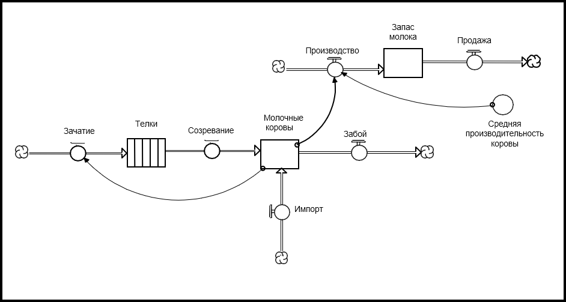

## Глава 2. Системное мышление и программа ithink. Улучшенные ментальные модели, которые воспроизводятся более надежно

...

### Улучшаем описание процессов в наших ментальных моделях

...

#### Последствия могут быть отложены во времени, последствия должны быть причиной других событий
...

Большинство специалистов по Системному Мышлению сказали бы, что корреляционные связи не подходят в том случае, если целью, на которую ориентирована ваша ментальная модель, является *повышение производительности*. «Если ты стремишься повысить свою производительность, то *причинно-следственная связь* должна быть основой твоего поведения!» - гласит, уже ставший практически бессмертным, встречный девиз Системного Мышления. Рассмотрим простой пример, который поможет проиллюстрировать вышеупомянутое утверждение…

Много лет назад, работая экономистом, я наткнулся на статью в популярном экономическом журнале, в которой была описана модель, целью которой являлось прогнозирование производства молока в США. Эта модель являла собой стандартный
«регрессионной анализ», и описывалась математически как…

***Y = (a_1 X_1 + a_2 X_2 + a_3 X_3 + …)***

**производство молока = f (ВНП, стоимость корма, процентные ставки, …)**

Говоря простым языком, согласно этой модели, производство молока в любом рассматриваемом году находится под влиянием определенного набора макроэкономических переменных. А именно, производство молока может быть спрогнозировано на основе изменений таких показателей, как ВНП, стоимость корма, процентные ставки и так далее. Стандартным способом, который используется при работе с данным типом моделей, является
«отслеживание истории» – «критерий адекватности», и рассмотренный пример не стал исключением.

...

Давайте вернемся к примеру с производством молока, для того, чтобы вышеупомянутое стало более наглядным. На рисунке 2-4 показана простая ithink модель, которая иллюстрирует операционную картину производства молока…

**Рисунок 2.4. Операциональная схема процесса производства молока**

Вкратце, имена существительные и глаголы в языке *ithink*, как вы узнаете из главы 3, представлены «прямоугольниками» и «трубами с кранами». Прямоугольники, две разновидности которых можно видеть на рисунке, представляют накопители (запасы). Трубы с кранами представляют какие-либо действия. Эти действия пополняют или опустошают накопители, изменяя их уровень. Например, если увеличится объем производства молока, то, следовательно, пополнится запас молока (в том случае, если объем продаж не превысит объем производства). Два накопителя, напрямую связанные с коровами: *Телки* и *Дойные коровы*, представляют собой *«конвейеры»*, которые отражают процессы «роста и старения». Таким образом, должно пройти немалое время с момента зачатия до того, как телята достигнут возраста, достаточного для начала их участия в производстве. «Проработав» определенное время, они становятся слишком старыми, и их исключают из производственного процесса.

...
