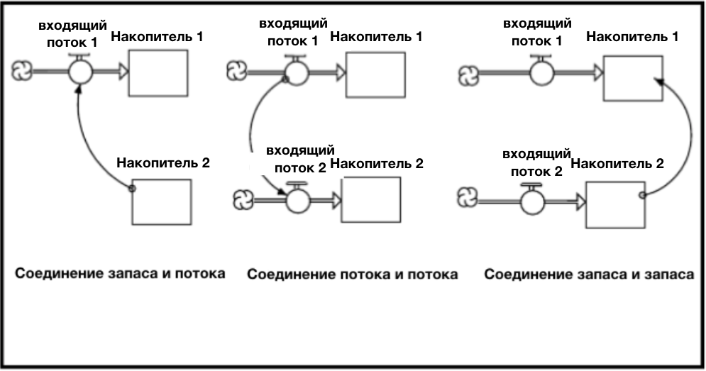
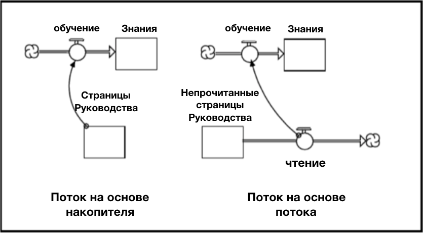
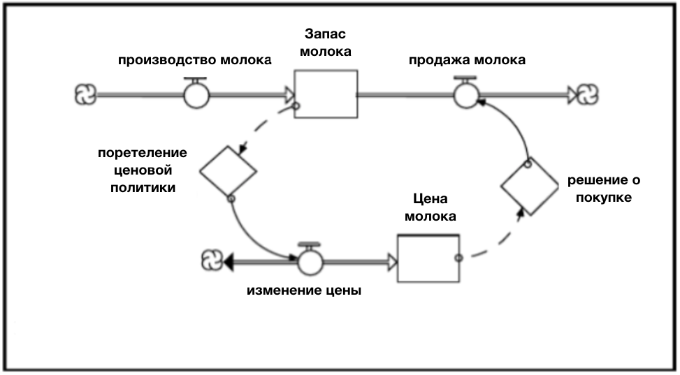

# Глава 5. Связывание предложений.
# *Операционное Мышление.*

Следующим важным шагом на пути к написанию параграфов является связывание предложений. Оказывается, есть только два способа сделать это.
Освойте различие между ними, затем узнайте, когда их использовать, и вы будете на пути к написанию абзацев!

### Два способа связывания предложений

Если вы думаете о том, как вы могли бы связать одно предложение с другим, то у вас есть три возможности ... но один из них не работает! На Рисунке 5-1 эти возможности перечислены.

**Рисунок 5-1. Три возможных способа связывания**

Первая возможность связывания одного предложение с другим - посредством соединения из запаса в одном потоке в другом. Понятие здесь состояло бы в том, что «условие» (то есть текущая величина запаса) создает вдохновение для принятия какого-либо действия (то есть заставляет объем потока быть больше нуля). Хорошим примером может быть, скажем, голод, стимулирующий вас есть... знакомы с этим, не так ли?

Второй способ также правдоподобен. В этом случае одно действие «переносит» другое действие. Простым примером будет ваше чтение этого текста и связанное с ним обучение, которое сопровождает его... что ведь происходит, правильно? 

Третий способ? Созданный с помощью дыма и зеркал ... программное обеспечение *ithink* не позволит такое соединение! Помните, что я сказал в Главе 3. Величина запасов не может измениться. Величины запаса меняются только путем наполнения и слива. Заполнение и отток - это *действия* (то есть глаголы!). И глаголы представлены *потоками*, а не теми тоненькими маленькими «проводами», которые вы видите на Рисунке 5-1. Только поток может изменить запас. Таким образом, единственный способ связать предложения - это связать запас с потоком или поток с потоком. И, как вы скоро увидите, имеет значение, какую из этих двух возможностей вы выберете!

### Потоки, сгенерированные запасами и потоками.

Взгляните на Рисунок. 5-2. Решите, какое из двух изображений имеет наилучшее значение представления процесса «передачи знаний», которое происходит с материалом, который вы сейчас читаете...

**Рисунок 5-2. Потоки, сгенерированные запасами и потоками.**

Если вы сказали представление с потоком, вы были правы! Если представление с запасом было бы правильным, то все, что нам нужно было бы сделать, чтобы вы могли быстрее учиться, - это добавить страницы в Руководство. Вам не нужно было бы предпринимать никаких *действий*, чтобы изучить материал, содержащийся на этих страницах, вы узнаете просто потому, что материал был там! Согласно представлению справа, чтение представляет собой «основу деятельности» для обучения. Если вы перестанете читать, вы перестанете учиться.

Последнее утверждение может быть не совсем точным, потому что вы, конечно, можете узнать материал, содержащийся в этом Руководстве, другими способами, кроме чтения! Но, если вы читаете, то это правда, что вы перестанете учиться у *этого* источника, когда перестанете читать.

### Представление соединителя

В предыдущем примере мы решили проблему, которая является хороши примером того, что создание ментальных моделей – всегда хорошо. Однако мы также могли бы смоделировать два представления на компьютере с помощью программного обеспечения *ithink*, и мы бы быстро обнаружили проблему с первым из двух представлений. Однако вы решили провести свои мыслительные эксперименты, где первый шаг в соединении предложений вместе - это определение того, имеет ли смысл связывать запасы с потоком или поток с потоком. И после того, как вы определитесь, вы будете использовать «соединитель» (тонкий провод) для соединения. Соединители, в силу своей роли «линкеров», становятся *конъюнктами* на языке *ithink*.

Как вы уже заметили, есть два типа соединителей в языке ithink. Тот, который мы использовали на рисунке 5-2, сплошной провод, называется «соединителем действия». Это потому, что провод передает «действие», а не «информацию». Чтобы сделать различие более ясным, рассмотрите Рисунок 5-3...

**Рисунок 5-3. Запас и спрос на молоко.**

Этот пример является продолжением «иллюстрации коров и молока» из Главы 2. Помните, что мы определили, что более «операционно» будет думать о *коровах*, производящих молоко, чем быть «функцией» таких вещей, как ВНП и процентные ставки! В этом примере четко видно различие между двумя типами соединителей.

Информация (представленная штриховым коннектором) излучает уровни содержания молока и служит одним из факторов, влияющих на решение о цене. Полная «логика» решения не видна на картинке, потому что она встроена в сжатый по пространству бриллиант принятия решений (DPD). Однако из этого процесса приходит решение! Решение, например, должно снизить цену на 10% или повысить ее на 20% или держать ее постоянной. Но дело в том, что информация приводит к решению, а решение приводит к *действию*! Следовательно, пунктирная проволока начинает процесс, и сплошная проволока заканчивает его. 

То же самое верно и со стороны спроса. Информация о ценах на молоко поступает потребителям. Это часть того, что влияет на количество молока, которое они будут покупать, и, следовательно, на количество продаваемого молока. Потребители принимают решения о покупке, а затем предпринимают *действия*, т.е. покупают определенное количество молока в этот день / неделю / месяц.

Информационные соединители, таким образом, несут информацию, которая используется для принятия решений. Затем провода действия передают действие, вытекающее из решения. Действие проявляется как изменение объема потока. Четкое различие в назначении между двумя типами соединителей объясняет, почему только информационные соединители могут «вставляться» в DPD. Однако оба типа проводов могут «выходить» из DPD, поскольку в дополнение к действию, которое будет принято в результате решения, также может быть передана информация о решении или о входных данных для этого решения. 
