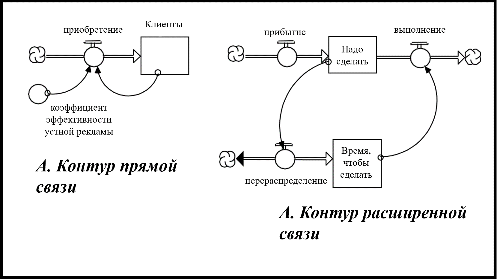

## Глава 6. Создание «Простых» абзацев. Замкнутое мышление
«Абзац» в контексте Системного мышления представляет собой «цикл обратной связи» - замкнутый цикл причинности. В предыдущих частях говорилось о том, что «абзацы» представляют собой интерес. Они интересны тем, что подобно заводным игрушкам – вы заводите их, а затем они действуют самостоятельно. То есть, циклы обратной связи *самостоятельно генерируют поведение.* Если вы столкнулись с таким - уходите с дороги!
Существует два типа петлей обратной связи: *противодействующий* и *усиливащий* (иногда заменяются техническими аналогами: *негативный* и *позитивный*, соответственно). Мы начнем с формального определения петли обратной связи, затем рассмотрим оба типа по отдельности, а также их комбинации. В данной главе мы остановимся только на *простых* циклах обратной связи, *простыми* они являются с технической точки зрения, а не как мера сложности. В седьмой главе мы познакомимся с *непростыми* абзацами.
### Определение Петли обратной связи
*Петля обратной связи* существует только тогда, когда «существительное» (запас) связано с «глаголом» (потоком) в *одном* предложении. Связь может быть прямой, либо являться частью цепочки ссылок, изначально проходящих через другие «предложения». Пример прямой и расширенной связи показан на рисунке 6.1.

 

**Рисунок 6.1. Петли с прямой и расширенной связью**

#### «Простые» циклы обратной связи

В примере с прямой связью потребители привлекают других потребителей с помощью мультипликатора «из уст в уста». В случае с расширеной связью,
