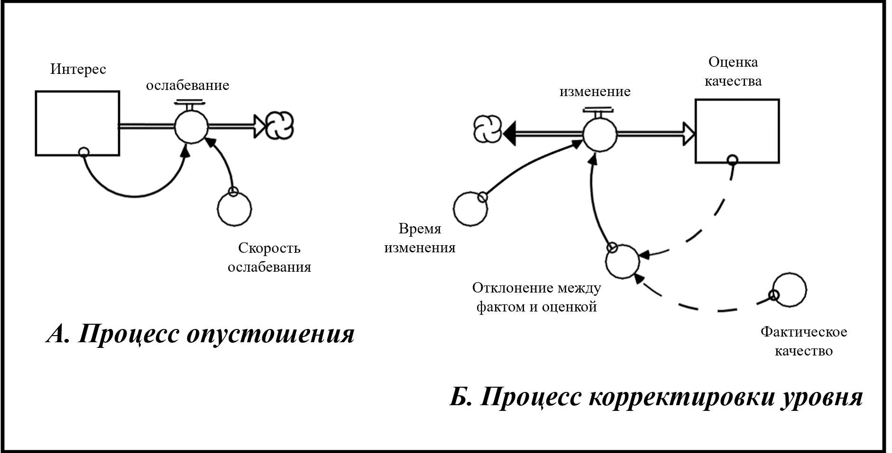

## Глава 6. Создание «Простых» абзацев. Замкнутое мышление
«Абзац» в контексте Системного мышления представляет собой «цикл обратной связи» - замкнутый цикл причинности. В предыдущих частях говорилось о том, что «абзацы» представляют собой интерес. Они интересны тем, что подобно заводным игрушкам – вы заводите их, а затем они действуют самостоятельно. То есть, циклы обратной связи *самостоятельно генерируют поведение.* Если вы столкнулись с таким - уходите с дороги!

Существует два типа петлей обратной связи: *противодействующий* и *усиливащий* (иногда заменяются техническими аналогами: *негативный* и *позитивный*, соответственно). Мы начнем с формального определения петли обратной связи, затем рассмотрим оба типа по отдельности, а также их комбинации. В данной главе мы остановимся только на *простых* циклах обратной связи, *простыми* они являются с технической точки зрения, а не как мера сложности. В седьмой главе мы познакомимся с *непростыми* абзацами.

### Определение Петли обратной связи
*Петля обратной связи* существует только тогда, когда «существительное» (запас) связано с «глаголом» (потоком) в *одном* предложении. Связь может быть прямой, либо являться частью цепочки ссылок, изначально проходящих через другие «предложения». Пример прямой и расширенной связи показан на рисунке 6.1.

**Рисунок 6.1. Петли с прямой и расширенной связью**

#### «Простые» циклы обратной связи

В примере с «прямой» связью потребители привлекают других потребителей с помощью мультипликатора «из уст в уста». В случае с «расширеной» связью все зависит от объема не выполненной в срок работы - ее рост/сокращение влияет на количество часов, выделенных на работу (*второй* запас). Увеличение/сокращение часов работы вызывает увеличение/сокращение скорости выполнения работы, тем самым приводя всю систему в равновесие и компенсируя просроченную работу.

В обоих случаях, существительное соединено с со своим «соседом» по предложению - глаголом. Каждый раз, когда такое происходит, мы имеем «петлю обратной связи». Подобные циклы очен важны для функционирования *всех* природных, физических и социальных систем. Без них не существовало бы ни единой формы жизни! Это однозначно говорит о том, что нужно больше узнать о принципах их действования.

#### *«Простые» циклы обратной связи*

Для обеспечения понимания процесса, следует начинать с наиболее простого. Это, безусловно, случай с циклами обратной связи, где  развитие событий может разворачиваться с бешеной скоростью. Важно иметь фундаментальные знания о структуре и поведении циклов обратной связи для последующего укрепления и накопления информации. Поэтому, в первую очередь, мы поговорим о концепции «простых» циклов.

«Простой» цикл обратной связи определен так по той причине, что имеет лишь одну *прямую* связь (в данном случае, связь запаса с притоком и оттоком), где все параметры (с точки зрения «производительности») являются постоянными. Такой цикл отображен на Рисунке 6.1А.

### Противодействующие циклы 

Циклы называются противодействующими, когда *препятствуют* изменениям. Любое действие, выполненное внутри такого цикла, вызывает противодействие в *обратную сторону*.

Подобные циклы можно встретить повсюду - каждая клетка нашего тела использует их для поддержания установленного химического и электрического баланса, обеспечивающих нашу жизнеспособность. По принципу таких циклов госудрство поддерживает уровень торговли и военного оснащения. И каждый организм любой формы жизни использует их для соблюдения порядка и сохранения правильных пропорций. Противодействующие циклы призваны поддерживать стабильность, так как без ее поддержания невозможна ни сама жизнь, ни рост. Ниже приведены некоторые примеры противодействующих циклов в действии.

Внедрение изменений внутри организации обычно вызывает ответную реакцию - сопротивление. Повышение температуры при физической нагрузке активирует процесс потоотделения для охлаждения тела до нормального состояния. Падение прибыли заставляет одновременно сократить расходы и увеличить доходы - оба процесса направлены на возвращение былой прибыли. Совершенная оплошность является угрозой для взаимоотношений, которая должна быть исправлена. Отток клиентов к конкурентам заставляет задуматься о способах возвращения клиентов обратно.

На рисунке 6.2 представлены два случая *простых* противодействующих циклов. Подобно примерам с «Внешним источником» и «Смежным потоком» из пятой главы, такие процессы имеют место быть. Поэтому, как и их предшественникам, мы дадим им имена - «истощение» и «восполнение запасов», соответственно. В приложении к данной главе кратко изложена информация о пяти основных шаблонах потоков, установленных в процессе работы (с пятым мы познакомимся позже, в этой главе). Мы пользуемся одним из пяти шаблонов, чтобы описать 80%-90% потоков в построенных нами моделями. Если вы хотите получить углубленные знания в области Системного мышления, изучите каждый из шаблонов более детально и обстоятельно, чтобы знать, в каких условиях применять тот или другой.

**Рисунок 6.2. Две реализации Простых противодействующих циклов**
