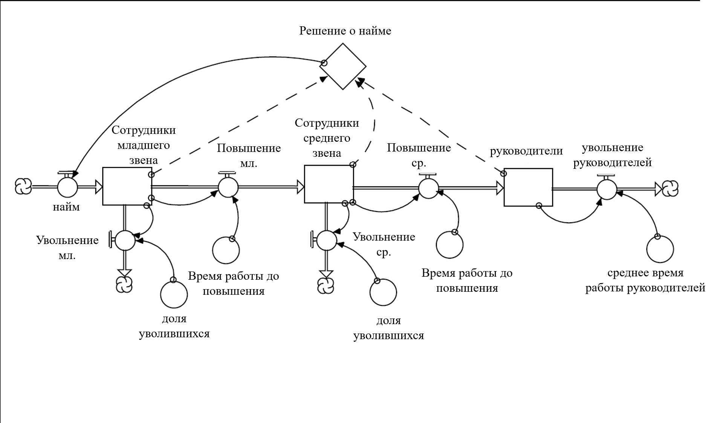
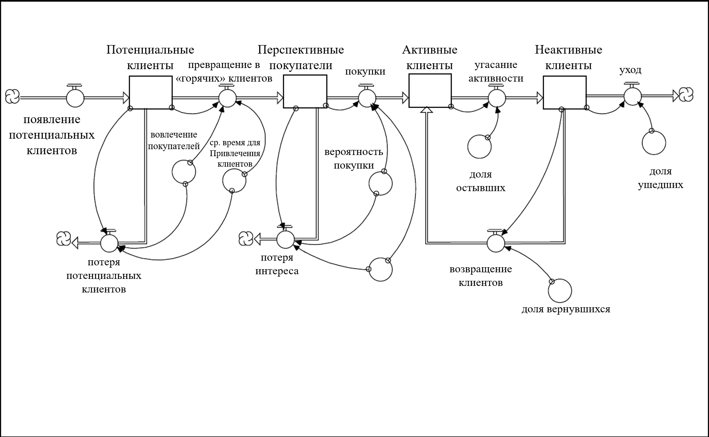

## Сюжетные линии, Часть 1
## Структура Основного каскада

Вы уже знакомы с основными частями речи, предложениями и абзацами, и теперь можно приступать к созданию коротких рассказов. Следующие две главы помогут вам построить несколько классических «сюжетных линий». В этой главе представлены 6 типов так называемой *Структуры Основного каскада*. Главный (основной) каскад - это скелет вашей модели. Каскад состоит из запасов, соединенных потоками. Хороший пример: цепь поставок, которая тянется от производителя к покупателю через дистрибьюторов, оптовиков и ритейлеров. В девятой главе вы познакомитесь с примерами классической структуры неосновного каскада.

Для каждого Главного каскада:

* Приводится краткое словесное описание

* Устанавливается, какие проблемные ситуации решаются посредством данного каскада

* Предлагаются способы кастомизации для ваших целей

* Устанавливается, каким типом модели *ithink* является данный каскад

Детально изучив процесс создания Основного каскада, вы сможете оценить, насколько широко можно их применять на практике. Я рекомендую вам обращаться к приложению в конце данной главы по мере создания моделей.

### Основной каскад для модели Кадровых ресурсов

#### Описание

Данный каскад описывает в очень обобщенном виде процесс прохождения потока человеческих (трудовых) ресурсов через организацию. Сотрудников берут на работу на «Начальном уровне». Затем они либо переходят на «Средний уровень», либо уходят из организации. Далее, опять же, либо они продвигаются на следующий - «Продвинутый уровень», либо увольняются. Продвижение по каскаду характеризуют такие специфические показатели, как доля ушедших и период обучения. Все потоки ушедших и проходящих обучение представлены с помощью шаблона «опустошения».

Основной Каскад для Кадровых ресурсов изображен на рисунке 8.1

#### Вопросы для рассмотрения

Модель иллюстрирует важные поведенческие характеристики структуры Основного каскада. *Основные каскады будут стремиться распределить ресурсы по запасам пропорционально величине среднего срока работы.* «Срок работы» (в данной модели) - это комбинация среднего времени работы до повышения и среднего времени работы перед уходом. К примеру, если в среднем сотрудники работают на начальном уровне в течение двух лет, на среднем в течение четырех, на руководящих постах в течение восьми, то Основной Каскад будет пытаться разбить число всех сотрудников на 3 уровня в пропорции 2-4-8 (или 1-2-4). Такое распределение может отличаться от реальных потребностей организации в штатных единицах с точки зрения экономической целесообразности и административного контроля. Пока это будет идти вразрез с потребностями, Основной каскад будет иметь «неявную целевую структуру» касательно распределения трудовых единиц, что будет стабильно приводить к «борьбе с системой». Система «физически» сильней, так что не надейтесь победить в этом случае.

#### Возможные допущения

1. Возможно сделать время повышения зависимым от целевого распределения трудовых ресурсов по уровням. Так, если в организации много единиц топ-менеджмента, то нужно увеличить сроки работы до очередного повышения.

2. Возможно связать долю уволившихся со сроками работы до повышения - так, к примеру, если период работы для новичков перед тем, как их повысят до работников среднего звена увеличится, то и доля уволившихся соответственно возрастет.

3. Можно разрешить нанимать на работу сотрудников всех трех категорий.

#### Расположение модели

*«HR Main Chain» (в папке «Intro to Systems Thinking»)*

 

**Рисунок 8.1. Структура Основного каскада для Кадровых ресурсов**

### Основной каскад для модели Клиентской сети

#### Описание

Данный каскад описывает стадии, пройдя которые, клиент из «потенциального» превратится в «активного». Структура процесса изображена на рисунке 8.2. Как видно по рисунку, существует несколько путей, позволяющих клиентам покинуть систему.

Шаблон «опустошения», или приближённый к нему вариант, описывает все потоки, за исключением одного. Для потоков *становятся «постоянными»*, *теряют возможности*, *покупки* и *потеря интереса* одновременно выполняются два процесса. Первый - затрачивается время, требующееся на завершение определенной стадии системы (*среднее время для привлечения клиента* и *время на принятие решения о покупке*). Второй - доля от общего потока, перешедшая на следующий этап (характеризуют такие показатели, как  *доля клиентов, ставших «горячими»* и *доля тех, кто делает покупки*).

#### Вопросы для рассмотрения

В данной модели интересна ситуация с относительной величиной притока и оттока из накопителя *Активные клиенты*. Многие маркетинговые стратегии и стратегии продаж фокусируются на входящем потоке - поиске путей для привлечения клиентов, допустим, привлекательными скидками. Но равный по важности *исходящий поток (отток)* часто оказывается забытым. Для сохранения клиентской базы *одинаково важно*  привлекать новых клиентов и сохранять уже имеющихся. Использование данной структуры в маркетинговой стратегии может помочь в достижении необходимого баланса между величиной притока и оттока.

#### Возможные допущения

1. Возможно сделать параметры *ср. время для привлечения клиента*, *время на принятия решения о покупке*, *доля тех, кто делает покупки*, *доля потерявших интерес (угасание активности)* зависимыми от таких вещей, как реклама, нацеленные почтовые рассылки, открытие шоурумов, качество продукта и клиентского сервиса.

2. Возможно добавить новые категории клиентов. К примеру, разделите *Активных клиентов* на *Новых* и *Ключевых*

#### Расположение модели

*«Customer Main Chain» (в папке «Intro to Systems Thinking»)*

 

**Рисунок 8.2. Структура Основного каскада для Клиентской сети**

### Основной каскад для модели процесса Управления

#### Описание

Каскад на рисунке 8.3 описывает активности и их связь в процессе управления. Обратите внимание на наличие цикла повторной работы и использование Конвейеров.

#### Вопросы для рассмотрения

* Используйте данную структуру в качестве отправной точки для осуществления реорганизации.

* Если вы кастомизируете структуру для своих целей, измените ключевые активности (Конвейеры на рисунке).

#### Возможные допущения

1. Возможно модифицировать каскад для того, чтобы он был ориентирован на ключевые процессы вашей системы.

2. Можно добавить вспомогательную структуру (ознакомьтесь в Главе 9) для обеспечения наглядности возможных ограничений ресурсов.

3. Можно добавить параметр *длительность цикла* для совершенствования и улучшения процесса моделирования (ознакомьтесь с папкой *Help Files* в программе *ithink* для того, чтобы узнать больше о данном параметре)

4. Возможно установить ограничения на входящий поток и мощность Конвейеров (пропускная способность). Добавьте Очереди перед Конвейерами, чтобы создать условия «превышения пропускной способности».

5. Возможно сделать время прохождения Конвейеров переменным параметром, а не константным.

6. Возможно сделать параметр утечки Конвейеров зависимым от условий внутри системы

#### Расположение модели

*«Administrative Main Chain» (в папке «Intro to Systems Thinking»)*

 

**Рисунок 8.3. Структура Основного каскада для Процесса управления**

### Основной каскад для модели Производственного цикла

#### Описание

Каскад на рисунке 8.4 описывает простой процесс производства. Есть цикл повторной работы. Обратите внимание, что четыре стадии процесса представлены с помощью Конвейеров.

#### Вопросы для рассмотрения

* Во многих производственных процессах ключевыми показателями эффективности системы являются задержки и запасы. В данном производственном цикле ключевыми системными единицами являются *сырье* и *товары, ожидающие контроль качества*. Постоянное накопление запасов говорит том, что система не сбалансирована.

* Если вы кастомизируете структуру для своих целей, подумайте о том, как цикл производства связан с другими бизнес процессами.

* После того, как данная взаимосвязь будет установлена, добавьте необходимые элементы в данную структуру и улучшите модель.

#### Возможные допущения

1. Можно строить процесс *заказа сырья* на основе спроса на данный продукт и уровне уже имеющихся запасов.

2. Можно добавить учет издержек (финансовый контроль).

3. Возможно расширять данную цепочку производственных элементов, чтобы учесть дополнительные шаги и процессы.

4. Возможно сделать время прохождения Конвейеров переменным параметром, а не константным.

5. Возможно делать расчеты длительности цикла и финансовых показателей.

6. Возможно использовать доп. модель для предоставления подробных сведений о *Статусе выполнения работы*.

#### Расположение модели

*«Manufacturing Main Chain» (в папке «Intro to Systems Thinking»)*

 

**Рисунок 8.4. Структура Основного каскада для Производственного цикла**

### Основной каскад для модели Поэтапного процесса выполнения работ

#### Описание

Данная модель описывает процесс последовательного выполнения работы в общих чертах. Предполагается, что задания выполняются поэтапно: работа над вторым заданием не начнется, пока не завершится работа над заданием один. Процесс изображен на рисунке 8.5.

#### Вопросы для рассмотрения

* Данная модель может быть использована в качестве симулятора проектного менеджмента. Можно наглядно убедиться в эффективности использования различных инструментов в кадровой политике и системе управления, влияющих на временные и финансовые затраты проекта.

* Модель может быть расширена для учета дополнительных заданий и процессов.

* Экспериментируйте с различными уровнями ресурсов, повторным выполнением работ, целевыми задачами и необходимым объемом работ для каждой отдельной задачи.

#### Возможные допущения

1. Можно добавить дополнительные задания.

2. Возможно использование дополнительной структуры *распределение ресурсов* (из Главы 9) для выделения определенного количества ресурсов на каждую отдельно взятую задачу.

3. Можно вводить параметр длительности цикла, чтобы рассчитать необходимое для завершения работ время.

#### Расположение модели

*«Work Flow Main Chain» (в папке «Intro to Systems Thinking»)*

 

**Рисунок 8.5. Структура Основного каскада для Поэтапного процесса выполнения работ**

### Основной каскад для модели с ресурсом и очередью

#### Описание

Данный каскад представляет собой процесс с ресурсом и очередью. Поток распределения *посетителей* является Пуассоновским. Процесс изображен на рисунке 8.6.

#### Вопросы для рассмотрения

* Можно использовать данную модель для анализа процесса с определенной точки зрения (позиции).

* Допустимо менять число посетителей и время обслуживания, чтобы найти наилучший баланс между количеством посетителей и временем их обслуживания. 

#### Возможные допущения

1. Возможно экспериментировать с параметрами для того, чтобы понаблюдать зрительно за поведением системы  при большом числе обслуживающих элементов или ресурсов.

2. Можно добавить контур обратной связи, связывающий длительность процессов со *средней скоростью прибытия*.

#### Расположение модели

*«Queue Server Main Chain» (в папке «Intro to Systems Thinking»)*

 

**Рисунок 8.6. Структура Основного каскада для процесса с ресурсом и очередью**

