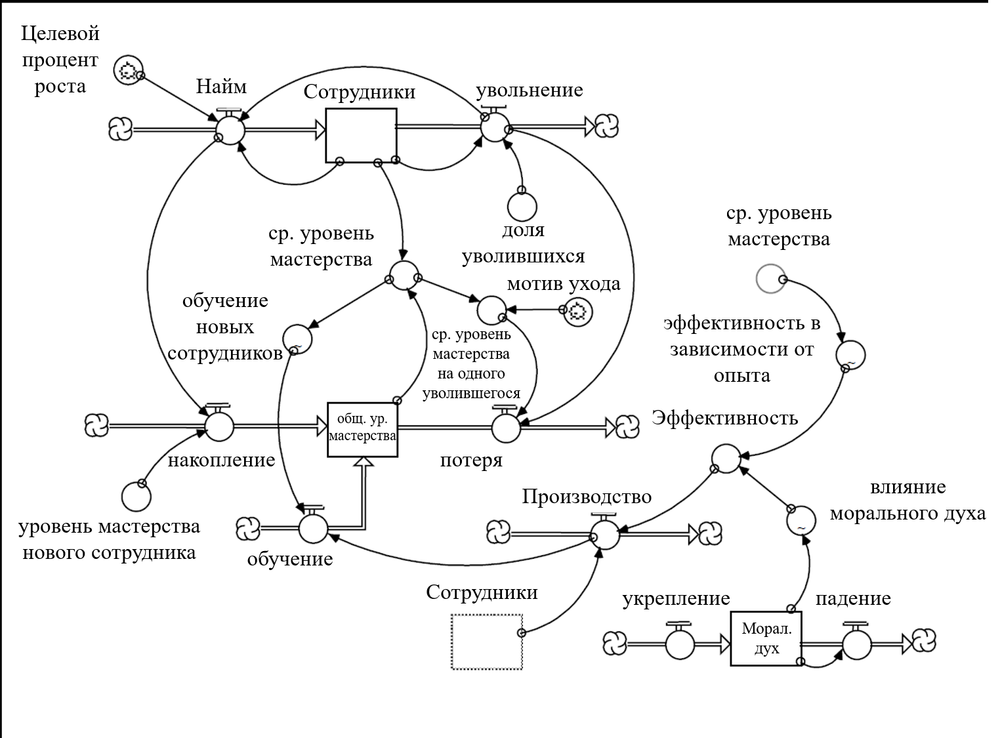
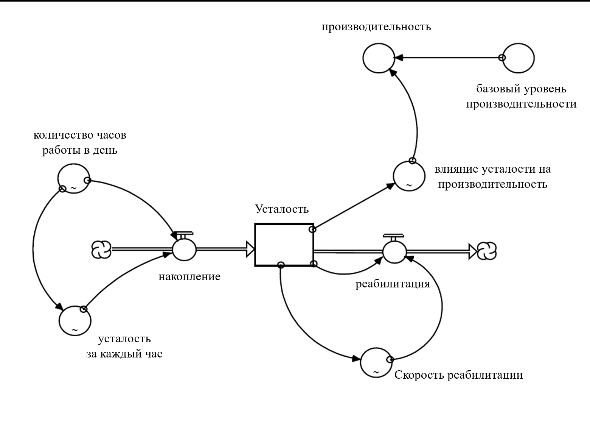
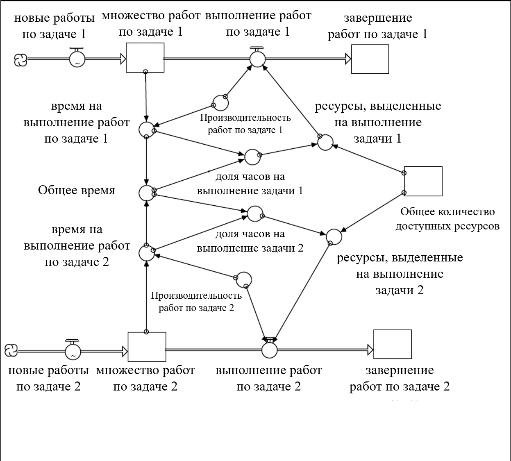
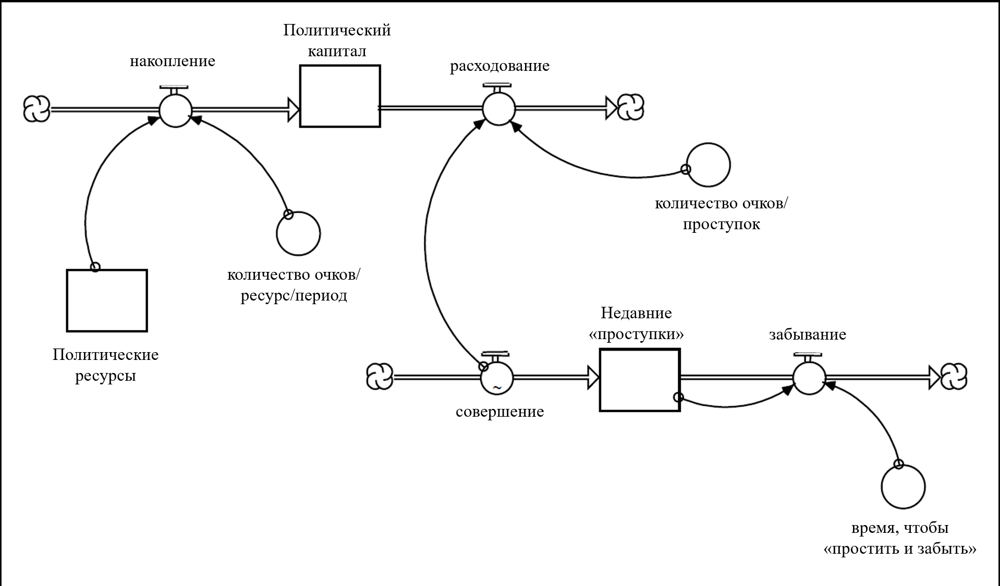
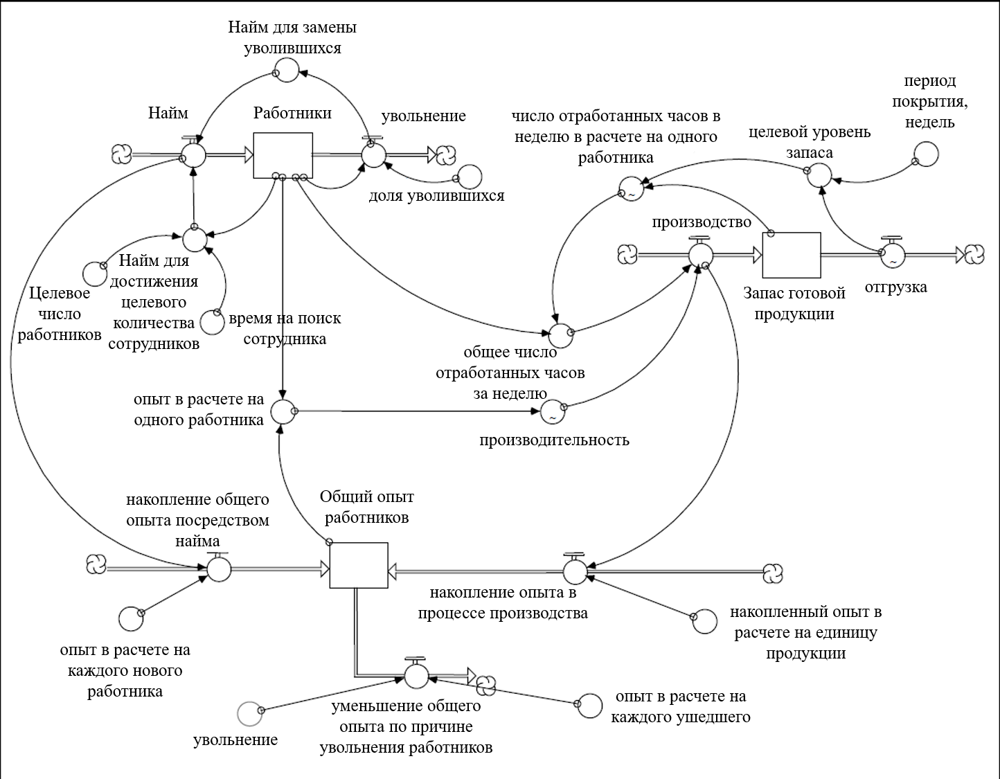
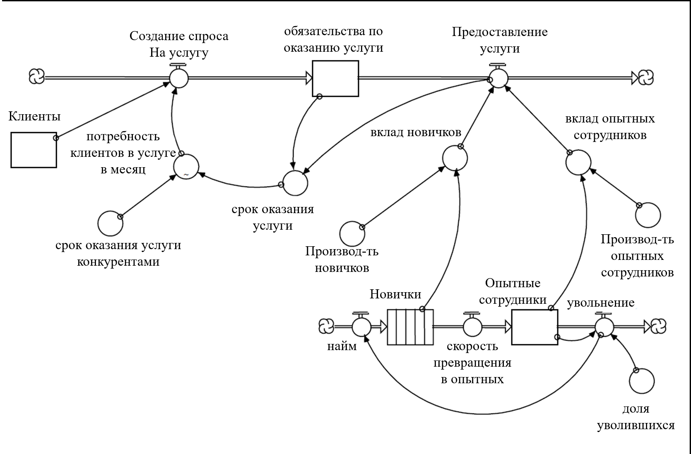
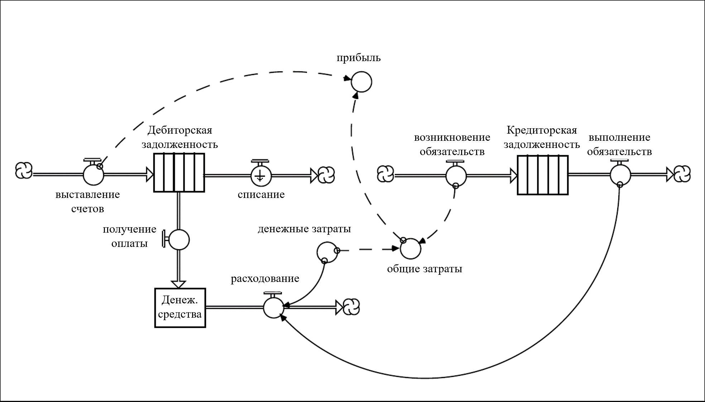

## Сюжетные линии, Часть 2
## Вспомогательные структуры

Данная глава повествует о следующей категории высокоуровневых «классических» структур, которые часто используются в моделировании с помощью пакета *ithink*. Мы будем называть их *Вспомогательные структуры*. Они подразделяются на 4 категории:

1. Ресурсные структуры

2. Производственные структуры

3. Оценочные структуры

4. Разнородные структуры 

Для каждой категории:

* Приводится словесное описание

* Предлагаются способы кастомизаци для ваших целей

* Устанавливается, каким типом модели *ithink* является данная структура

### Ресурсные структуры
### Человеческие ресурсы: *Одноуровневая*

#### Описание

Структура описывает систему Кадровых ресурсов, включающую найм и уход сотрудников, в самом общем виде. *Необходимость найма* может возникать по нескольким причинам: для замены ушедших сотрудников и для расширения кадровой сети. Поток *уход сотудников* представлен с помощью шаблона «истощения»; *доля ушедших* относится к накопителю *Трудовые ресурсы*.

Процесс изобажен на рисунке 9.1.

#### Возможные допущения

1. Можно добавить *Список кандидатов*, откуда отбирают сотрудников. Добавьте контур обратной связи от *Списка кандидатов* к *Найму* (потому что процесс найма будет активироваться, если количества сотрудников недостаточно).

2. Можно добавить контуры обратной связи от остальных компонентов системы (таких как учет финансовых показателей) до *целевого процента роста*.

3. Можно связать контурами такие переменные, как моральное состояние с *долей ушедших сотрудников*.

#### Расположение модели

*«One Tier HR Infras» (в папке «Intro to Systems Thinking»)*.

 

**Рисунок 9.1. Одноуровневая структура учета Человеческих ресурсов**

### Человеческие ресурсы: *Двухуровневая*

#### Описание

Структура построена на основе одноуровневой с добавлением второй категории соискателей. В данном примере Конвейер используется для категории *Новички* в организации. Обратите внимание на «потерю потока», показывающую *уход новичков*.

Процесс изображен на рисунке 9.2

#### Возможные допущения

1. Можно добавить дополнительные категории соискателей.

2. Можно добавить список кандидатов, откуда набираются сотрудники.

3. Можно добавить контур связи с *процентом достижения целевого уровня* и/или *долей ушедших*.

4. Поместите *Новичков* в Резервуар, затем используйте шаблон «истощения», чтобы показать процесс оттока (*уход новичков*) и *скорость превращения*

#### Расположение модели

*«Two Tier Headcount Infra» (в папке «Intro to Systems Thinking»)*.

 

**Рисунок 9.2. Двухуровневая структура учета Человеческих ресурсов**

### Человеческие ресурсы: *Отслеживание признака*

#### Описание

Используйте данную структуру, когда вам необходимо оценить значимость какого-либо признака или атрибута связанного с уровнем определенного накопителя в вашей модели. Структура позволяет посчитать скользящее среднее значение для признака. Обратите внимание, что данная структура широко используется со смежным (совместным) потоком, описанным в пятой главе.

Процесс изображен на рисунке 9.3.

#### Возможные допущения

1. Можно привязать все условия вашей модели к *эффективности обучения*.

2. Возможно использование контура обратной связи для *среднего уровня опыта* с *наймом* и *уходом*, так же, как и для *опыта в расчете на каждого нового сотрудника* и *опыта на долю ушедших*. 

#### Расположение модели

*«Attribute Tracking Infrastructure» (в папке «Intro to Systems Thinking»)*.

 

**Рисунок 9.3. Структура отслеживания признака**

### Человеческие ресурсы: *Эффективность*

#### Описание

Эффективность (продуктивность) сотрудников - очень значимый показатель практически в каждой модели, связанной с трудовыми ресурсами. Структура затрагивает два ключевых фактора эффективности: моральный дух и уровень мастерства. Данный пример хорошо показывает, как моделировать нетривиальные переменные с помощью программного пакета *ithink*. Загляните в Главу 13 для получения дополнительной информации о моделировании качественных характеристик.

Процесс изображен на рисунке 9.4.

#### Возможные допущения

1. Можно связать *Моральный дух* с другими переменными в системе.

2. Можно привязать *средний уровень мастерства* к множеству других переменных в системе.

#### Расположение модели

*«HR Productivity Infra» (в папке «Intro to Systems Thinking»)*.

 

**Рисунок 9.4. Структура Эффективности человеческих ресурсов**

### Человеческие ресурсы: *Выгорание*

#### Описание

Структура может быть интегрирована с предыдущей (рисунок 9.4). Выгорание используется в расширенном примере в Главе 13 (моделирование качественных характеристик)

Процесс изображен на рисунке 9.5

#### Возможные допущения

1. Можно связать Выгорание с Моральным духом и наоборот.

2. Можно связать *эффективность* (*производительность*) с *производственным потоком*, который уменьшает *Накопившуюся работу*, так как формирует накопитель *Завершенной работы*. Используйте *Накопившуюся работу*, чтобы определить необходимое *количество часов работы на каждый день* 

#### Расположение модели

*«Burnout Infra» (в папке «Intro to Systems Thinking»)*.

 

**Рисунок 9.5. Структура Выгорания человеческих ресурсов**

### Человеческие ресурсы: *Распределение ресурсов*

#### Описание

Данная структура рекомендована к использованию, когда вам необходимо выделить ресурсы на каждую из множественных задач. Алгоритм распределения основан на правиле «Смазывания скрипучего колеса». Это значит, что ресурсы распределяются пропорционально количеству не выполненной в срок работы для каждой задачи. Больше работы нужно выполнить - больше ресурсов на это нужно выделить. *Продуктивность* - значимый фактор, который следует учитывать при распределении. Рассмотрим пример, чтобы убедиться в этом. Представим, что Задолженность 1 требует выполнения заданий в два раза больше, чем их число при Задолженности 2. Это значит, что для их выполнения потребуется в два раза больше ресурсов. Однако продуктивность в случае с первой задолженностью может быть *в два раза выше*, чем при выполнении задач для закрытия второй задолженности. Тогда это потребует *равного количества ресурсов* на выполнение работы в обоих случаях.

Процесс показан на рисунке 9.6.

#### Возможные допущения

1. Можно добавить дополнительные задания.

2. Можно допустить изменчивость параметра продуктивности.

3. Можно добавить в алгоритм распределения дополнительные когнитивные параметры и значимые факторы.

#### Расположение модели

*«Resource Allocation Infrastructure» (в папке «Intro to Systems Thinking»)*.

 

**Рисунок 9.6. Структура Распределения ресурсов**

### Физический капитал

#### Описание

Данная структура имеет в составе конвейер и резервуар, чтобы отслеживать износ и амортизацию материальных активов (линейным способом). Стуктура удобна в использовании в процессе учета активов.

Процесс изображен на рисунке 9.7

#### Возможные допущения

1. Можно добавить дополнительные источники финансирования.

2. Можно разгруппировать структуру, чтобы соотнести активы cо сроками их полезного использования.

#### Расположение модели

*«Physical Capital Infrastructure» (в папке «Intro to Systems Thinking»)*.

 

**Рисунок 9.7. Структура Физического капитала**

### Финансовые ресурсы

#### Описание

Данная структура описывает движение денежных средств в общем виде. Обратите внимание на онвертацию абсолютной величины *Денежные средства* в относительную величину *ликвидность*. Часто с относительными величинами работать бывает легче, так как иметь дело с долями и числами, кратными 1 приятнее, чем с абсолютными большими числовыми значениями.

Процесс изображен на рисунке 9.8

#### Возможные допущения

1. Можно добавить доплнительные категории для учета издержек.

2. Можно установить специфику различных категорий на значение ликвидности.

#### Расположение модели

*«Financial Resources Infrastructure» (в папке «Intro to Systems Thinking»)*.

 

**Рисунок 9.8. Структура Финансовых ресурсов**

### Политический капитал

#### Описание

Структура используется в качестве шаблона для описания процесса восприятия информации и работы памяти. Обратите внимание, что накопитель *Недавние нарушения* связан с вяходящим из него истощающим потоком. Этот поток показывает стирание воспоминаний о ранних нарушениях с течением времени.

Процесс изображен на рисунке 9.9.

#### Возможные допущения

1. Можно связать *Общее число обещаний на период времени* и/или *Нарушенные обещания* с *Недавними нарушениями*.

2. Можно связать *Общее число обещаний на период времени* с *Политическими обещаниями*

3. Можно связать *время, чтобы простить и забыть* с *Недавними нарушениями* - чем больше последних, тем длиннее период времени.

#### Расположение модели

*«Political Capital Infrastructure» (в папке «Intro to Systems Thinking»)*.

 

**Рисунок 9.9. Структура Политического капитала**

### Производственные структуры
### Производство продукции

#### Описание

Данная структура описывает ключевые аспекты производственного процесса в общем виде. В ней есть некоторые особенности - учитывается сверхурочная работа, меняющийся целевой показатель объемов производства и обучение на опыте.

Процесс изображен на рисунке 9.10.

#### Возможные допущения

1. Можно добавить другие факторы, влияющие на показатель продуктивности.

2. Можно связать *внеурочную работу* с накоплением Выгорания (что влияет на *продуктивность* и *долю уходящих работников*).

3. Можно связать *Накопленный стаж на единицу продукции* со *Средним стажем*.

#### Расположение модели

*«Product Production Infrastructure» (в папке «Intro to Systems Thinking»)*.

 

**Рисунок 9.10. Структура Производства продукции**

### Производство услуг

#### Описание

Как и в случае с производством продукта, процесс производства услуги состоит из нескольких небольших структур, объединенных в операционный процесс. К примеру, обратите внимание на два типа сотрудников с характерными показателями продуктивности. Оценка эффективности данной системы производится при помощи параметра *сроки доставления услуги*, который базируется на спросе.

Процесс изображен на рисунке 9.11.

#### Возможные допущения

1. Можно добавить исходящие потоки, которые предотвратят спрос на услугу (например, рост *сроков предоставления услуги*). 

2. Можно добавить потоки, характеризующие приток и отток *Клиентов*.

3. Можно использовать параметр длительности цикла для расчета *сроков предоставления услуги*.

#### Расположение модели

*«Service Production Infra» (в папке «Intro to Systems Thinking»)*.

 

**Рисунок 9.11. Структура Производства услуг**

### Оценочные структуры
### Финансовые: *Движение денежных средств & Прибыль*

#### Описание

Данная структура является основой при оценке финансовых показателей. Конвейеры демонстрируют процессы взыскания *Дебиторской задолженности* и выплат по *Креиторской задолженности*. Обратите внимание, что *списание* является «сквозным потоком» из Конвейера *Дебиторской задолженности*, а не оттоком, как это может показаться изначально. Здесь что списание означает, что клиентские обязательства «полностью прошли конвейер» без «утечек». Получение выплат (то есть погашение дебиторской задолженности) представлено вытекающим потоком.

Процесс изображен на рисунке 9.12 

#### Возможные допущения

Можно посчитать ликвидность (вернитесь к структуре Финансовых ресурсов в начале данной главы) и связать с *тратой денежных средств*.

#### Расположение модели

*«Cash Flow Infrastructure» (в папке «Intro to Systems Thinking»)*.

 

**Рисунок 9.12. Структура Движения денежных средств и получения прибыли**

