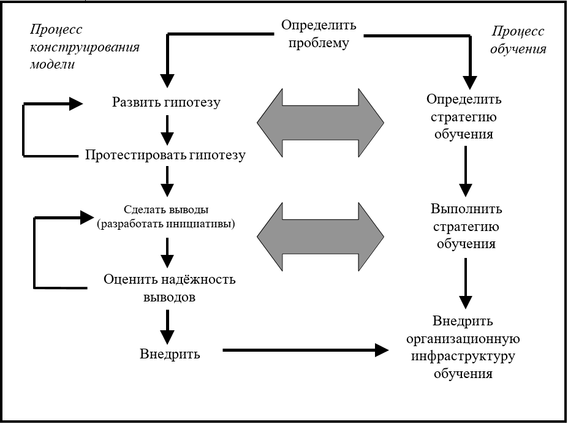
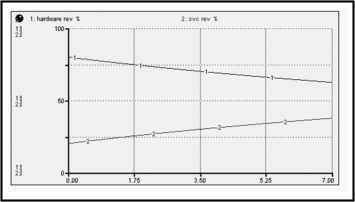
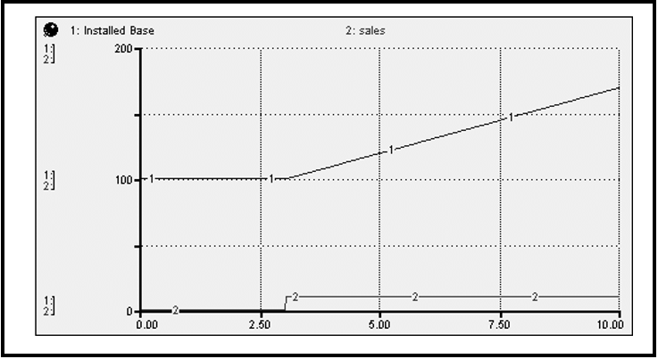
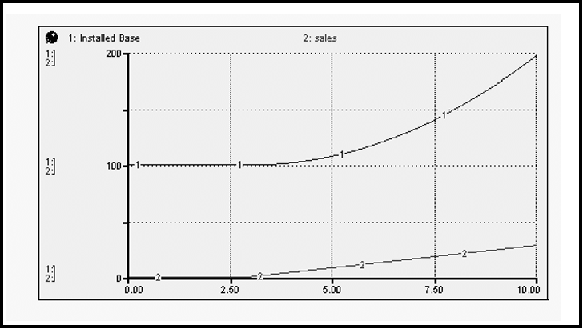

## Глава 11. Иллюстрируя процесс "написания"

Как было отмечено в главе 10, модели, построенные с использованием программного обеспечения *ithink*, как правило, подразделяются на две основные категории: Инструменты обучения и Операционные инструменты. В этой главе я покажу их компромисс. Я в деталях проведу вас через процесс «написания» Инструмента обучения. Этот пример является реальной, хотя и замаскированной его реализацией. В конце примера инструмент обучения эволюционирует в Операционный инструмент. Таким образом, вы получите некоторое представление о том, как оба инструмента выходят из процесса "написания". Для обсуждения я буду использовать «шаги» процесса, которые указаны в предыдущей главе. Эти шаги для удобства приводятся на рисунке 11-1.

***Рисунок 11-1. "Шаги" в процессах конструирования модели/обучения***

### "Написание" рассказа

Конкретный рассказ, который я укажу здесь, отличается тем, что он один из самых коротких из когда-либо написанных. Описание того, как он был написан, намного длиннее самой истории! Тем не менее, он также является одним из наиболее эффективных с точки зрения разъяснения этого важнейшего вопроса, понимания и стимулирования продуктивных действий.

#### Предыстория
Клиент в этом рассказе является технологической фирмой, которая была основана инженером и известна своей инженерной культурой. Фирма гордилась доставкой «самого навороченного оборудования» в бизнесе! Доходы и прибыль неуклонно росли с каждым годом. Однако в последние пару лет в организации появилась проблема. Она начала проявляться сильнее, и генеральный директор решил привлечь команду старшего руководства, чтобы серьезно ее рассмотреть. Главным героем этой проблемы был вице-президент организации обслуживания клиентов. Этот джентльмен, назовем его Джейком, не был инженером, и для него все было в порядке. Он одевался экстравагантно, использовал (то, что чувствовали инженеры), новомодный язык, был общительным и имел репутацию «громкого» человека (грохочущий смех, бурные разговоры в коридоре и т.д.). Своим внешним видом и стилем работы Джейк резко выделялся на фоне типичного инженера фирмы.

Джейка также винили в том, что он «создаёт империю». При обвинениях инженеры быстро собирали аргументы для поддержки своего мнения. За последние несколько лет количество сотрудников и бюджет для «полевой» организации (в частности, для обслуживания клиентов) увеличились гораздо быстрее, чем соответствующие показатели у инженеров, хотя численность инженерных кадров и бюджет также существенно выросли. Кроме того, доля доходов фирмы, поступающих от обслуживания клиентов, пропорционально возрастали в зависимости от доходов с продаж оборудования.

Инженеры чувствовали, что имидж компании как технологического лидера находится под угрозой со стороны очень заметной нетехнической персоны Джейка. Инженерное сообщество также обеспокоилось тем фактом, что все большая доля от общего операционного бюджета выделяется как раз организации обслуживания клиентов. Такое распределение средств было в большистве своём воспринято как результат закулисного «политического маневра» Джейка. Это маневрирование, как показали доходы, превратило компанию, по мнению инженеров, в организацию предоставления услуг и увело её от изначальной и основной миссии. Пальцы недовольных указывали на Джейка. В это время, Джейк и его растущая армия работали, игнорируя критику. Их позиция была той же: "*Посмотрите на нижнюю строку!*" Генеральный директор сочувствовал обеим позициям и нуждался в чём-то, что сможет примирить стороны до того, как всё переросло в вооружённый конфликт!

#### Определение проблемы и Стратегия обучения
Будь я консультантом по организационному развитию, я бы, вероятно, определил этот вопрос как ориентированный на Джейка, а затем продолжил рассмотрение того, что можно было бы сделать для правильного соответствия его самого и доминирующей инженерной культуры. На самом деле позже, уже после того как мы завершили нашу работу, консультант по организационному развитию был сохранен и продемонстрировал хорошие результаты после применения такого подхода. Однако, если бы я был консультантом, генеральный директор вряд ли бы обратился ко мне в тот момент. Вместо этого, зная что-то об «этой системной штуке», он хотел посмотреть, перейдёт ли ситуация от личностей к разборкам "на кулаках". Я был молодым, наивным весельчаком.

С самого начала было ясно, что у старшего руководства мало времени и интереса к созданию навыков Системного Мышления, необходимых для самостоятельного исследования проблемы. Это был тот случай, когда «построить модель» собрался эксперт извне. Тем не менее я посчитал, что команда после исследования не только улучшила свое понимание конкретной проблемы, но и обзавелась некоторыми общими навыками Системного мышления.

Я начал с опроса *каждого* члена старшего руководства. Чрезвычайно важно, чтобы каждый из участников был опрошен, если планируется «событие», связанное с исследованием. Оставьте кого-нибудь, и этот человек почти наверняка станет «проблемой» во время такого мероприятия! Такие интервью полезны для того, чтобы "дать команде толчок". Они также проливают свет на межличностную динамику и помогают вам получить целостное представление об организации.

Из интервью я сделал от двух до трех графиков ключевых переменных с течением времени, чтобы увидеть, какое, если таковое имеется,  "обобщение" проблемы привлекло внимание команды. Члены команды довольно быстро сошлись на рисунке, изображенном (замаскированном) на рисунке 11-2.

***Рисунок 11-2. Отноcительное увеличение доходов от услуг (на графике 1 - доходы от оборудования, 2 - доходы от услуг)***

Доход был тщательно наблюдаемым параметром внутри организации в целом. Команда сочла, что относительный рост доходов от услуг символизирует снижение относительной важности инженерной организации.

После того, как эта картина была "перед" командой, проблема была сфокусирована и стала рабочей. Каждый мог бы взглянуть на простую динамическую модель поведения и сказать: «Да, вот и все!». Для меня картина четко определила цель моделирования. Как это часто бывает, эту цель лучше всего сформулировать в вопросе: *существует ли правдоподобная гипотеза, отличная от создания империи, которая может объяснить относительный рост доходов от услуг?*

#### Развить гипотезу

Как быстро показал процесс интервью, бизнес фирмы был действительно сложным. Было много разнообразных товарных линий, обслуживающих многочисленные сегменты рынка по широким географическим регионам. Обилие обсуждений по поводу продукции еще больше добавило сложности. У нас был этот чип, и этот автобус, и совершенно новая штуковина, которая появится в следующем квартале. Поговорим о корневых волосах!

Мой внутренний взгляд «с высокой перспективы» подсказал, что относительный феномен увеличения доходов не был результатом отношений по поводу корневого волоса. Но даже если бы это было так, хорошая практика системного мышления (и другие научные практики, например «Бритва Оккама») продиктовала бы, что я не начну думать на этом уровне. Итак, я оттолкнулся от корневых волосков, за деревьями, до вершины леса. Я задал себе следующий вопрос: *если бы я строил простейшую возможную модель бизнеса этой фирмы, какой первый показатель я бы вывел на экран?* Это очень похоже на поставленный в главе 2 вопрос о первой переменной, которую вы включили бы в операционную модель производства молока. Это подход, который я постоянно использую, чтобы «сбивать себя с пути» гипотезы, он звучит примерно так: «а давайте просто получим что-то простое на экране и посмотрим, что произойдёт, когда мы сымитируем его». Он почти всегда даёт что-то интересное. В этот раз получилось нечто большее. Всё быстро прояснилось... для меня. Тогда я задумался о том, как я собираюсь «донести мысль до всех». Но пойдём по порядку...

У себя дома я создал показатель под названием «Установленная база». Он представлял собой совокупное количество «устройств», которые компания передала в руки клиентов. Используя подход "сверху-вниз", я не предпринял никаких усилий для дезагрегирования «устройств» по многочисленным продуктовых линиям фирмы, для дезагрегирования клиентов по разным сегментах рынка, обслуживаемым компанией, или для дезагрегирования этих клиентов по географическому признаку. Эта модель выглядела как настоящая компания? Абсолютно нет! Было ли это хорошей отправной точкой для расследования проблемы? Абсолютно да! Одно из преимуществ того, что вы можете выполнить хотя бы часть работы оффлайн, это то, что вам предоставляется роскошь начинать "просто": вам не нужно просить клиента, умолять его, унижаться, а затем ещё и настаивать на своей правоте.

После того, как показатель «Установленная база» встал на своё место, я задал следующий (очевидный) вопрос: *"Какие потоки связаны с этим показателем?"* Их было в основном два. Первым был приток, назовём его продажи (я бы предпочел слово «реализация», но клиент мог бы подумать, что это странно). Второй - отток, назовём его «изъятие из обращения». Я решил проверить, смогу ли я просто игнорировать отток как таковой. Я оправдывал это тем, что: 
1. Проблема была отнесена к условиям дохода, а отток не приносил доход;
2. Темпы оттока были довольно небольшими по сравнению с темпами продаж / притока;
3. В течение следующих пяти лет не было бы значительных выбытий, связанных с большим, как прогнозировалось, объемом продаж.

В принципе, я был неумолим в своем стремлении создать наиболее простую возможную модель, которая могла бы объяснить это интересное явление. Вы также должны быть неумолимыми в своих действиях!

Итак, моя первоначальная схема выглядела так, как вы видите на рисунке 11-3. Не особо впечатляет, правда? Это очередной пример старой пословицы: не судите книгу по ее обложке! Не впечатляет на первый взгляд? Да. Не может впечатлять вообще? Ни в коем случае! Давайте посмотрим, почему.

***Рисунок 11-3. Первоначальная схема

#### Протестировать и проверить гипотезу

Как только вы получите предварительную схему, прежде чем придавать ей законченный вид, «проверьте» ее! Помните, что вы ищете *простейшую возможную* гипотезу, которая может объяснить данное явление. Она должна смотреть на *вас* прямо в лицо. Итак, ищите её! Вы делаете это, *имитируя* модель. Мой коллега, Стив Петерсон, придумал очень полезное выражение. Он очень верно подметил: *«Никогда не уходите слишком далеко от имитуруемой модели»*. Зафиксируйте это выражение в памяти и постоянно держите его в голове, когда строите модели. Это сэкономит вам бесконечное количество времени и избавит от массы разочарования. Имитируйте. Если нужно, пересмотрите/расширяйте модель, затем снова имитируйте, и так далее. Очень короткие циклы предположений, проверка ... обновлённая гипотеза, опять проверка ... и так до победного конца.
 
Подобным образом я хотел смоделировать гипотезу, которая была у меня. Буду ли я в субботу днем, не имея доступа к корпоративным базам данных клиента, ограничивать себя в желаниях и не делать модель из-за отсутствия «реальных чисел»?. Скорее всего нет, и я надеюсь, вы не позволите себе оставаться в тупике. На самом деле даже если у вас *есть* доступ к готовым бесконечно точным числовым данным через SAP, Oracle или ERP-систему на ваш выбор, я бы настоятельно рекомендовал вам не использовать эту возможность - по крайней мере, не сейчас. Прежде чем искать какие-либо реальные числовые данные, вы должны буквально просто «вбросить некоторые числа в модель». Затем посмотрите на полученные *повременные шаблоны поведения*, а не на числовые значения! Когда вы выбираете числа, которые подставляете в модель, выбирайте красивые и простые цифры - не большие и странные. И, если приемлемо, выберите их таким образом, чтобы привести модель в стабильное начальное состояние.

В этом случае достичь начального состояния было достаточно легко. Поскольку стабильное состояние означает, что все показатели в системе остаются неизменными, единственный способ добиться этого в рамках этой модели - сделать приток нулевым. Вы хотите инициализировать свою модель в стационарном состоянии для первых раундов тестирования, поскольку она позволяет начать «чтение» истории динамики вашей модели с самого начала. То есть модель находится в идеальном равновесии, вы «поражаете ее» чем-то минимальным, выбивая её из равновесия, и история начинает разворачиваться. Определение вашей модели в состоянии, отличном от баланса, эквивалентно сдвигу истории к определенной точке сюжетной линии, а затем ее замораживанию. В момент, когда происходит имитация, вы «размораживаете» историю. Вы понятия не имеете, как оно дошло до этого момента, а уже вовсю происходит действие (так как система стремится восстановить равновесие или импульсивно разрастается/сворачивается). Устойчивое состояние очень важно для первоначальных тестов гипотез!

Чтобы реализовать стратегию тестирования по устойчивому состоянию, вам также необходимо, чтобы в торговле использовались «идеализированные тестовые входы». Это «что-то», что вы можете использовать, дабы «выбить» систему из своего стационарного положения. Двумя любимыми методами являются функции STEP и PULSE (оба доступны как встроенные в ithink). Идея здесь состоит в том, чтобы просто «пинговать» систему, вызывая тем самым естественный частотный отклик и делать это без «привода» (то есть навязывания динамики из внешнего источника).

Я решил использовать функцию STEP в качестве тестового ввода. Поскольку продажи были первоначально нулевыми (что продиктовано устойчивым состоянием), я увеличил их с 0 до 10 в момент времени 3. Когда я это сделал, я получил результат, изображенный на рисунке 11-4. Ответ, хотя и предсказуемый, после отражения оказался очень интересным. Он предполагает определённое соотношение между темпами продаж и связанной с ними моделью поведения, прослеживаемой с помощью установленной базы. Если поток продаж остается постоянным, установленная база будет расти линейно. Это означает, что если фирма продолжает продавать свои «устройства» с постоянным темпом (т.е. без роста производственной части бизнеса), основа для бизнеса по обслуживанию клиентов все равно будет *расти* с постоянной скоростью.

***Рисунок 11-4. Реакция на шаговое увеличение продаж (на графике 1 - установленная база, 2 - продажи)

***Рисунок 11-5. Реакция на постепенное увеличение продаж
