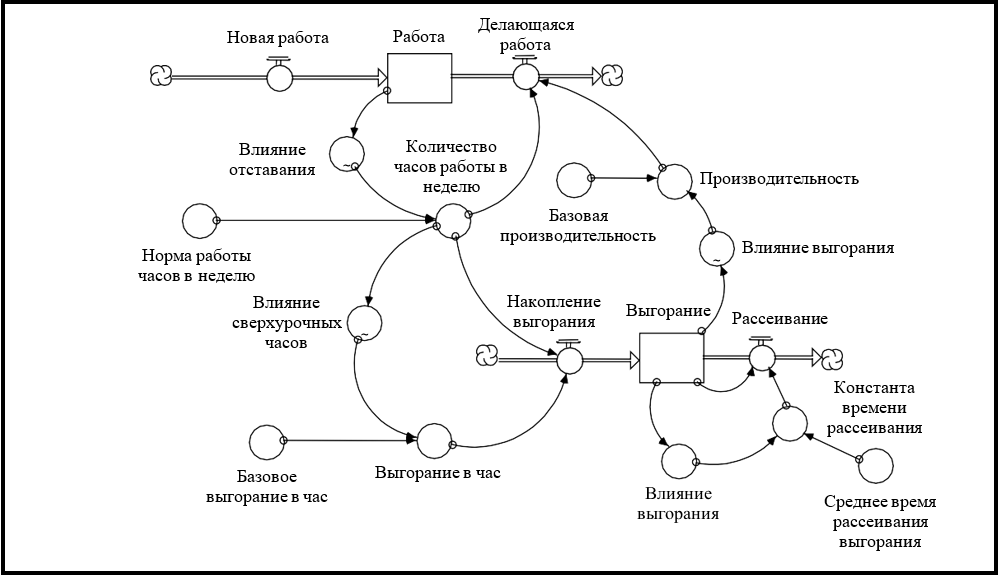

## Глава 13. Добавление текстуры в ваши композиции
### *Моделирование «мягких» переменных*

Такие вещи, как самооценка, заинтересованность и доверие, обычно не упоминаются в одном ряду с компьютерами. Такие переменные «сентиментальны» и аморфны, а компьютеры являются научными, численными и точными. Но, знаете, эти переменные абсолютно необходимы для эффективного функционирования систем, в которых играют роль люди - не всех, но многих! Оставляя такие переменные вне модели, в которой подразумевается их присутствие, равнозначно предположению, что они не имеют отношения к ней. Будьте честными. Можете ли вы представить себе *какую-либо* систему, включающую людей, для которых доверие, уверенность в себе, заинтересованность и чувство собственного достоинства (и это лишь некоторые переменные) совершенно неактуальны?

Реальная проблема здесь - одна из целей модели. У многих моделей есть неявная или даже явная цель, точное числовое предсказание. «Свет мой, модель, подскажи, да всю правду доложи, какие процентные ставки, доходы, продажи будут осенью». С точностью до тысячных, спасибо. Дело в том, что никогда не будет точной меры разочарования, уверенности, любви или гнева. Действительно, измерение таких переменных является «трудным» даже в теории. Это из-за давно признанного «эффекта Хоторна» - сам акт измерения вызывает изменение того, что измеряют. Физики знают этот эффект как «принцип неопределенности Гейзенберга». Итак, если цель модели - точное предсказание, царство «сентиментов» почти наверняка останется за бортом.

Учитывая все это, давайте отступим и беспристрастно посмотрим на ситуацию. Варианты: вы можете продолжить работу с моделью, чья цель - численно-точное прогнозирование, но умышленно не учитывающей переменные, несколько которых (возможно, основных) влияют на работу системы. Или вы можете пожертвовать определенной численной точностью, но не обязательно аналитической строгостью, чтобы включить «мягкие» переменные, которые, как вы знаете, играют важную роль в формировании динамики системы.

Вот еще полезная информация, которая поможет вам оценить два варианта. Численно-точное предсказание на самом деле недостижимо, потому что всегда есть переменные, которые влияют на результаты, но не контролируются лицами, принимающими решения в системе (и, следовательно, непредсказуемыми). Кроме того, преследование в качестве цели прогноза противоречит реактивной, ориентированной на проблему позиции, в отличие от, например, стремления понять, как обеспечить устойчивость перед силами, которые вы не можете контролировать! Численная точность для этих целей редко так же важна, как и получение качественной сущности соответсвующих отношений. Перевод: сентиментальные переменные приветствуются!

Таким образом, не всегда необходимо включать «мягкие» переменные в ваши модели. Но когда вы знаете, что эти переменные важны, вы не должны умышленно их игнорировать! В этой главе вы узнаете, как довести «мягкие» переменные до полного, первоклассного статуса «граждан» в ваших моделях.

### Различие между количественной оценкой и измерением

Одна из причин, почему люди уклоняются от мягких переменных, состоит в том, что они не могут распознать одно важное различие. Это различие между количественной оценкой и измерением.

Измерение означает «определение величины». Часто результат определения выражается численно. Для физических величин мы имеем множество предопределенных единиц измерения. Например, у нас есть мили, метры, килограммы, килограммы, кварты и кубические сантиметры. Очень точно можно измерить количество единиц в инвентаре готовой продукции. Также можно измерить высоту и вес ребенка, расстояние до дома бабушки или диаметр цирковой палатки с большой точностью.

Напротив, количественная оценка означает «присвоение числового индекса». Вы можете количественно оценить все! В процессе существует некоторый врожденный произвол. Например, если кто-то попросил меня количественно оценить мой уровень усталости, первый вопрос, который я задал бы ... «По шкале от скольки до скольки?» Когда получен ответ «от 0 до 100» или «от 1 до 10», я могу выбрать число, чтобы определить уровень усталости. Вы тоже можете! И так же можно сделать для нашего уровня уверенности, похоти, зависти, заинтересованности и всех других нефизических переменных, которые оживляют нашу жизнь!

Итак, легко количественно оценить что-либо. Настоящий трюк заключается в том, чтобы сделать это таким образом, чтобы вы могли поддерживать строгость мысли, связанную с физическими (то есть измеримыми) переменными в модели. На самом деле, нет никакого «трюка»... как вы потом поймете.

### Количественная оценка «мягких» переменных

Я буду использовать пример количественной оценки переменной, чтобы проиллюстрировать работающий подход. Затем я завершу эту главу выделением самой сути и обобщением связанных процессов и принципов.

Пример включает в себя так называемое «выгорание». Выгорание охватывает целый континуум психологических состояний. Это и легкая усталость, которая возникает после тренировок в течение нескольких ночей подряд. Это и так называемая «средняя прожарка», когда вы уже тренируетесь один-два месяца. Ваша программа упражнений становится все меньше и меньше, а диета распадается на фаст-фуд и шоколад. Каждый раз, когда вы пробуждаетесь, вы клянетесь, что потратили время на сон, только чтобы быть готовым к следующей тренировке. Наконец, есть «сильная прожарка». Этот случай обычно требует клинического лечения и отказа от тренировок на долгий срок.

Как и при представлении *любой* подобной нефизической величины, первый шаг в представлении «выгорания» внутри модели не имеет абсолютно *никакого* отношения к числам! Это важно. Первый шаг - задать себе классический вопрос Cистемного Мышления: «Как это работает?»

Подумайте об этом секунду, прежде чем продолжить. Как действительно работает процесс выгорания?

Диаграмма, представленная на рисунке 13-1, предлагает один из ответов. Он прдеполагает то, что процесс «накопления выгорания» носит *сопутствующий* характер. Накопление выгорания сопутствует выделению часов на работу и, соответственно, недостаточному количеству часов для действий, которые рассеивают накопившееся выгорание. Как показывает диаграмма, каждый час работы к запасу выгорания добавляется определенное количество выгорания. По мере нарастания уровня выгорания постепенно снижается производительность. По мере того, как производительность падает, при прочих равных условиях, еще больше увеличивается отставание в работе. Это заставляет рабочих «бросать» еще больше времени на проблему, вызывающую выгорание, вследствие чего выгорание только увеличивается. Порочный цикл, будь он неладен!

***Рисунок 13-1. Простая модель выработки выгорания***

