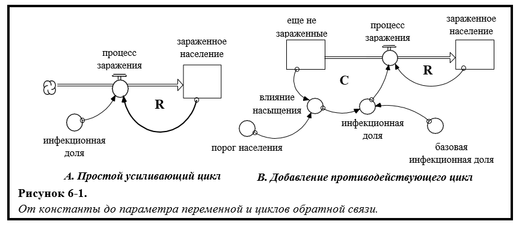
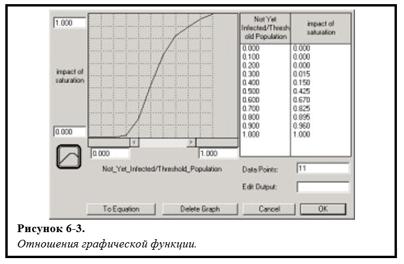

## Глава 6: Конструирование «более интересных» абзацев. *Замкнутое и нелинейное мышление*

### Возможность параметров варьироваться

В 5 главе мы рассмотрели «простые» циклы обратной связи. В этой главе мы рассмотрим два условия, которые определяют циклы как «простые». Мы примем во внимание изменения параметров, связанных с циклом обратной связи, а также расширим ссылки, из которых состоит цикл обратной связи, для привлечения более чем одного "предложения". Как вы увидите в дальнейшем, ослабление этих двух ограничений позволит циклам обратной связи генерировать гораздо *более* богатое разнообразие динамических действий, чем это было возможно при «простых» циклах!

Прежде чем мы продолжим рассматривать ссылки для создания циклов обратной связи с участием *нескольких* предложений, давайте посмотрим, какое характерное изобилие мы можем вызвать, позволяя изменять параметры в *прямой* структуре цикла обратной связи. На рисунке 6-1А изображен простой усиленный цикл обратной связи (как показано на рисунке 6-1 с буквой «R»). Как было описано в 5 главе, если оставить цикл действовать самостоятельно, это приведет к тому, что *Инфицированное население* будет всегда расти экспоненциально.

На рисунке 6-1B был добавлен противодействующий цикл (как показано на рисунке 6-1 с «C»). Точка соединения между усиливающим и противодействующим циклом находится в переменной *доля зараженных*. Вместо того чтобы оставаться постоянной, на нее теперь воздействует (то есть умножается) «эффект насыщения», который зависит от размера *Незараженного населения*. То, как данная зависимость обнаруживается, иллюстрирует одну из самых мощных функций программного обеспечения STELLA. Но прежде чем рассматривать эту функцию, я хочу быть уверенным, что вы «видите» противодействующий цикл (обозначенный на рисунке 6-1 «C»).

Цикл работает следующим образом: после того как значение Незараженного населения опускается ниже некоторого порогового уровня, *воздействие насыщения* начинает снижать *долю инфекции*, которая, в свою очередь, замедляет скорость *заражения*. По мере того как *население, которое еще не инфицировано*, продолжает уменьшаться, воздействие становится все более депрессивным - в конечном счете поток будет *полностью заражен*. Эта взаимосвязь отражает тот факт, что с меньшим количеством людей, которые еще не инфицированы, становится все труднее находить человека, который восприимчив к инфекции (то есть без иммунитета или какой-либо защиты от болезни)! Таким образом, воздействие насыщения приводит к разрыву роста *зараженного населения*. Противодействующий цикл «охлаждает» отводящий усиливающий цикл. Какой шаблон будет отслеживать *Зараженное население* в результате этого взаимодействия между противодействующим и усиливающим циклом? 

Если вы подумали о «S-образном росте», то вы были правы, это изображено на рисунке 6-2.

Если вы так не подумали, то вот почему вы должны были... В начале моделирования, когда население незараженных людей велико, *доля заражения* находится на самом высоком уровне. Она остается постоянной какое-то время, потому что *воздействие насыщения* еще не «нагнетается» (то есть противодействующий цикл оказывает нейтральное воздействие). Это означает, что усиливающий цикл работает так, как будто он изолирован, усугубляется с *постоянной* процентной ставкой. Поэтому мы должны ожидать *экспоненциального роста* инфицированной популяции в течение определенного периода времени. И это именно то, что происходит на ранней стадии симуляции. Если вы посмотрите на траекторию, прослеживаемую Инфицированным населением примерно до 7 лет, то можно заметить, что она экспоненциальна. После этого она постепенно прогрессирует медленнее (верхняя часть «S»), пока к концу симуляции она практически не перестает расти.

Итак, вам может быть интересно ... Как эта невидимая маленькая *инфекционная доля* справляется со всей этой магией? Как она может оказывать все большее влияние, а количество *незараженного населения* уменьшаться? Она работает благодаря очень важной и мощной функции в программном обеспечении STELLA. Эта функция называется «графической функцией».

#### Графическая функция

Взгляните на рис. 6-1B. Если вы внимательно посмотрите на *долю инфекционных*, вы увидите знак (хотя и тонкий) его «утери безгрешности» (в свое время он был просто неизменным). Обратите внимание на маленький знак «~» на лице? «~» обозначает «графическую функцию». Графические функции выражают связь между входной переменной и выходной переменной. В частности, они указывают, как изменится выходная переменная при изменении соответствующей входной переменной. Важно отметить, что они выражают двумерные отношения, не прибегая к математике, а скорее используя эскиз с сеткой на нем. По существу, вы *рисуете* отношения, которые вы себе представляете.

Таким образом, графические функции позволяют не-математически склонным людям выражать отношения, которые до сих пор в значительной степени ограничивались областью математики. Конечно, математики также могут использовать графическую функцию, и многие делают это довольно эффективно. Если бы вы дважды щелкнули на переменной *воздействия насыщения*, то увидели бы что-то вроде того, что показано на рисунке 6-3.

Графические функции *не являются* графиками вывода модели во времени. Вместо этого они используются для представления «структурных отношений» внутри модели. Они показывают, как данная переменная изменяется в результате движений какой-либо другой переменной.

В этом случае воздействие насыщения определяется переменной. Переменная, определяющая его, - это пропорция *еще незараженного населения* к *пороговому* значению. Значение, принимаемое «воздействием», будет определяться значением, принятым этой пропорцией. Когда количество *еще незараженного населения* не превышает или равно *пороговому значению* (то есть пропорция больше 1.0), «воздействие» будет принимать значение 1.0. Графические функции *сохраняют* свои конечные значения (то есть они *не* экстраполируют кривые за пределы рисунка). Как видно на рисунке 6-3, когда пропорция *еще не зараженного* населения к пороговому значению (которое является константой) опускается ниже 1,0, «воздействие» становится все более удручающим (помните, что «воздействие» было умножено, поэтому меньшее значение означает *более* удручающее воздействие). Когда пропорция падает до 0,2 (то есть еще количество *еще незараженного* населения составляет 20% от *порогового значения*), рост числа инфицированных людей равен нулю, поскольку множитель воздействия будет принимать значение нуля в этой точке.

